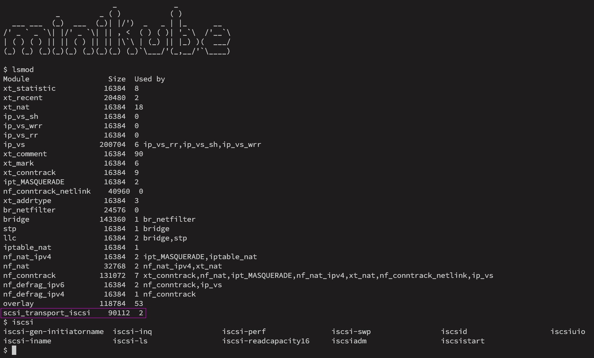

# minikube-with-iscsi

This is the `minikube` VM compiled with an additional patch that enables iscsi support.  
  
In order to deploy [Longhorn](https://longhorn.io/) on minikube, the iscsi initiator must be present in the host (minikube VM) OS. Unfortunately, `minikube` currently does not have the iscsi kernel module and associated system apps present in its distribution. Fortunately, anyone can [compile the `minikube` VM.iso on their own](https://minikube.sigs.k8s.io/docs/contrib/building/iso/). Therefore, the purpose of this patch and custom VM.iso build is to facilitate the usage of Longhorn on a local `minikube` cluster.  
  
To launch a `minikube` cluster with iscsi support, download [minikube-iscsi.iso](https://github.com/589290/minikube-with-iscsi/raw/main/minikube-iscsi.iso) and then start `minikube` with a command similar to below (works with any driver, kubernetes version, or runtime) specifying the usage of the local .iso file:  

```
minikube start \
  --iso-url=file://$(pwd)/minikube-iscsi.iso \
  --driver=hyperkit \
  --container-runtime=docker \
  --kubernetes-version=1.19.16
```

SSH'ing into the patched VM, the iscsi kernel mod and associated iscsi system apps are present:  



Without the patched VM, for comparison, output of the same commands:


...and of course, the goal... a working Longhorn deployment utilizing the patched VM!  


As a comparison, the patched VM is about 2.5 megabytes larger in size:


